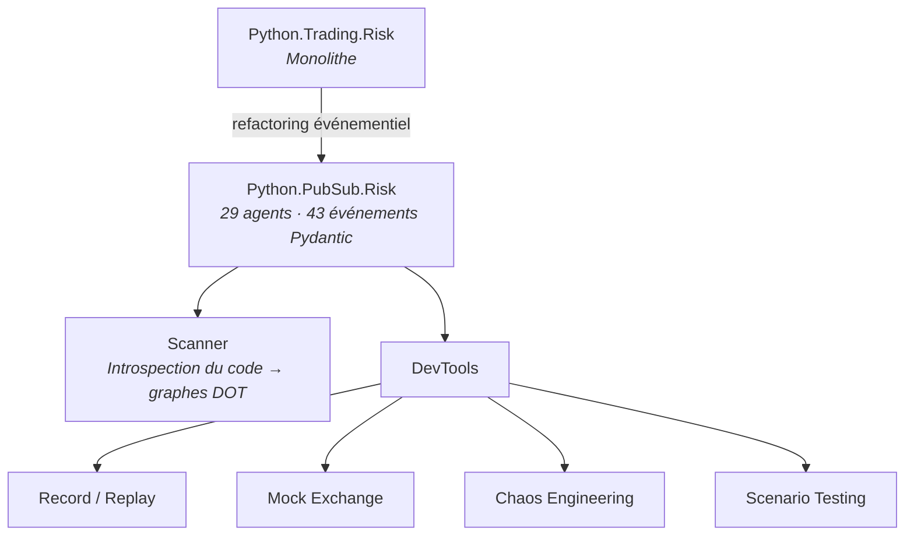

# venantvr.trading

Plateforme de trading algorithmique crypto multi-exchange (Binance, Gate.io, KuCoin, OKX, Bybit) avec architecture événementielle.

## Repos

### Core

 privé
*Python / ccxt* — Bot de trading monolithique : allocation multi-pool, stop-loss/take-profit dynamique, sizing de position, gestion de sorties, intégration multi-exchange (ccxt), persistance SQLite, commandes Telegram. Configuration Pydantic, optimisation Optuna.

 privé
*Python / Socket.IO* — Refactoring événementiel du monolithe : **29 agents autonomes** (achat, vente, indicateurs, monitoring, capital...), **43 événements Pydantic** typés, orchestrateur pub/sub, 172 tests. Architecture CQRS avec agents spécialisés (BuyConditionEvaluator, SaleExecution, CapitalRefresh, PanicSellCommand...).

### Librairies

 public
*Python / Pydantic* — Value objects DDD immuables : Token, USD, Price, Percentage avec opérateurs arithmétiques surchargés, conversions automatiques, factory BotPair, sérialisation JSON. 73 tests unitaires.

 public
*Python / pandas / numpy* — Indicateurs techniques modulaires : RSI multi-timeframe, VIX (volatilité), patterns de bougies (candlestick), détection de drops, passthrough. Classe abstraite Indicator extensible.

 public
*Python* — Utilitaires zéro dépendance : décorateurs de cache dynamique bi-format (JSON/Pickle avec chemins templates), logger structuré fichier/console, redirection de stdout pour capture.

 public
*Python / Flask / Socket.IO* — Client pub/sub spécialisé trading : routage par topics, handlers typés, file d'attente de messages thread-safe, reconnexion automatique, mode hybride HTTP/WebSocket. Module positions intégré.

### Monitoring Telegram

 public
*Python* — Framework Telegram déclaratif en Clean Architecture : composants séparés (Client, Sender, Receiver, Service), retry automatique avec backoff exponentiel, file de messages asynchrone, historique de conversations persisté.

 public
*Python* — Bibliothèque Telegram par décorateurs `@command` : menus inline dynamiques, prompts multi-étapes, configuration par annotations, protocoles typés, gestion de sessions HTTP.

### Outillage événementiel

 public
*Python* — Scanner d'introspection de code événementiel : analyse statique des agents et événements, génération de graphes DOT (flux, hiérarchie), détection d'anomalies, collections Postman automatiques, mode continu ou one-shot. CLI `pubsub-scanner`.

 public
*Python / Flask* — Suite DevTools complète en 4 modules : **record/replay** d'événements, **mock exchange** (simulation avec scénarios de marché), **chaos engineering** (injection de pannes, délais, corruption), **scenario testing** (assertions sur flux). Dashboard web intégré, CLI Click.

## Évolution architecturale

## Stack

- **Python** exclusivement, licences MIT
- **5 exchanges** supportés via ccxt : Binance, Gate.io, KuCoin, OKX, Bybit
- **Pydantic** pour le typage strict des 43 événements
- **Socket.IO** pour le messaging temps réel inter-agents
- **Telegram** pour le monitoring, le contrôle et les alertes
- **SQLite** pour la persistance des positions et de l'historique
